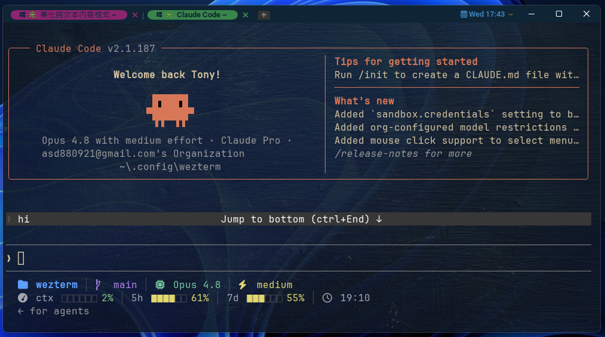
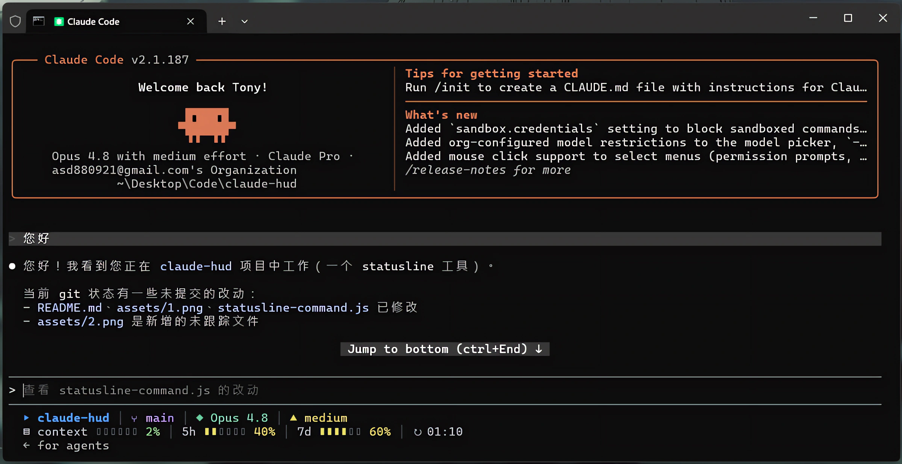

# Claude 終端 Hud

#### WezTerm (Nerd 圖示版)


> WezTerm 可至 **[asd880921/wezterm-config](https://github.com/asd880921/wezterm-config)** 找到官網連結開始安裝 WezTerm 並套用該主題。

#### Windows Terminal (純文字版)



## 前置準備

- **Node.js** — 腳本以 node 執行。還沒安裝請至 [nodejs.org](https://nodejs.org/) 下載 LTS 版,裝好後用 `node -v` 確認。

## 安裝步驟

1. 下載專案至 `~/.claude/` (Windows 為 `C:\Users\<你>\.claude\`)
    - 使用 Git Clone：
      ```bash
      git clone https://github.com/asd880921/claude-cli-hud.git
      ```
    - 在 GitHub 頁面找到 **Code → Download ZIP** 下載並解壓縮至 `~/.claude/` 底下。 

2. 返回上一層找到 `settings.json` ( `~/.claude/settings.json`)  
開啟加入以下內容，並將路徑指向專案的 `statusline-command.js`：

   ```json
   {
     "statusLine": {
       "type": "command",
       "command": "node \"C:/Users/<你>/.claude/claude-cli-hud/statusline-command.js\""
     }
   }
   ```

3. 重啟 Claude Code 或開新 session。

> Hud 的第二行狀態需要 **對話開始** 才能取得資料顯示；  
> `5h` / `7d` / 重置時間(5h limit) 三個項目另需 **Claude.ai 訂閱** 才會正常顯示。

## 自訂

全部邏輯在 `statusline-command.js`
- **顏色** (`c` 物件 / `pctColor()`)
- **圖示** (`ic` 物件)、**進度條**(`makeBar()`)
- **版面** (`line1` / `line2`)。

## 備註
- 腳本從 stdin 讀 Claude Code 的狀態列 JSON，欄位見 [官方文件](https://docs.claude.com/en/docs/claude-code/statusline)。
